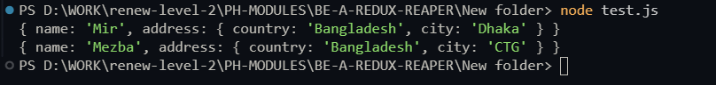
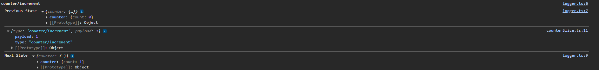
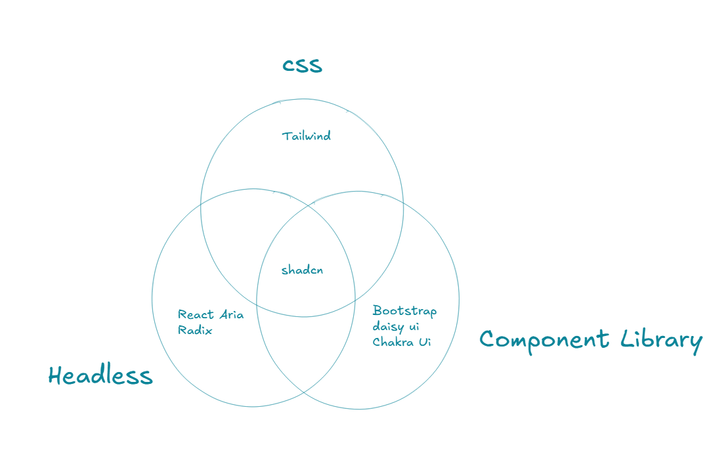

# Bootstrapping Basic Redux Project 

Welcome to a power-packed module where concepts meet code!


In this stage of your Redux Reaper journey, we’re not just talking theory — we’re building. You’ll solidify your understanding of functional programming, dive into mutation control, and unlock advanced techniques like currying and Redux middleware.


Then we take it further — by combining Redux logic with modern UI tooling using Shadcn UI, React Router, and real-world component architecture. From creating modals, card views, and dark mode, to wiring up the Redux store with selector functions — this is where it all comes together.

By the end of this module, you'll see how clean architecture, functional programming, and scalable state management merge into a professional-grade UI.


## 22-1 Basics of Functional Programming.

- reducer functions must have to be a pure functions
- In OOP all things are compare with object.
- In Functional Programming all things are compared with a mathematical function. Its like that for the same  input there will be same output. This is basically called pure function. No matter how many times called it will show same result. 

```js 
//* Pure function 

const add = (a, b) => a + b //2+5 = 7

console.log(add(2, 5));
console.log(add(2, 5));
console.log(add(2, 5));
console.log(add(2, 5));
console.log(add(2, 5));
```

- We might think that the reducer functions are not pure because they seem to mutate the state. However, they are actually pure — the input stays the same, and Redux Toolkit (with Immer) handles the state updates immutably under the hood.

```ts 
import { createSlice } from "@reduxjs/toolkit";
const initialState = {
    count: 0
}
const counterSlice = createSlice({
    name: "counter",
    initialState,
    reducers: {
        // through state we will get the initial state value
        increment: (state) => {
            state.count = state.count + 1
        },
        decrement: (state) => {
            state.count = state.count - 1
        }
    }
})

// exporting the reducers
export const { increment, decrement } = counterSlice.actions

export default counterSlice.reducer;

```
- Lets understand the impure functions 

```js
let total = 0;
const addToTotal = (amount) => (total = total + amount);

console.log(addToTotal(8))

```
- This is a impure function because here a side effect occurred because here total(global variable) is from outside the function nad its getting updated from inside the function. If other function becomes dependent on total then it will be mess. 

```js
const updateDate = () =>{
    new Date()
}
```

- here each and every time the time is changing and this is giving different value so its a impure function. 
  
```js

const randomNumber =  (amount) =>{
    return amount + Math.random()
}

console.log(randomNumber(3))
console.log(randomNumber(3))
console.log(randomNumber(3))
console.log(randomNumber(3))
```
- Each an every time it give random and different value so its also a impure function 
- Over the discussion we can say if for the same input the output is not the same its impure. If same then ist called pure function 
- In Functional Programming we Must need to use Pure functions. 

## 22-2 Understanding mutation and ways to avoid it.
- Mutation means we can mutate(change) a data 
- In js array and objects are referenced type data. Those can be easily muted. 

```js 
const employee = {
    name: "Mir",
    address: {
        country: "Bangladesh",
        city: "Dhaka"
    }
}

const employee2 = employee

employee2.name = "Sazid"
// this will mutate the main object (employee) as well. because stored in heap memory and just an address is kept inside the main memory. and both are referring same object

console.log(employee === employee2)
// this will return true because this is being checked using reference. because both are referring same object

console.log(employee)
console.log(employee2)
```

- `employee2.name = "Sazid"` this will mutate the main object (employee) as well. because stored in heap memory and just an address is kept inside the main memory. and both are referring same object
- `console.log(employee === employee2)` this will return true because this is being checked using reference. because both are referring same object
- To avoid mutation we need to use spread operator 

```js
const employee = {
    name: "Mir",
    address: {
        country: "Bangladesh",
        city: "Dhaka"
    }
}

const employee2 = {
    ...employee,
    name: "Sazid"
}

console.log(employee === employee2)

console.log(employee)
console.log(employee2)

```
- Now `console.log(employee === employee2)` will show `false`. because by spreading we are making different object.  

- This part also has some problem. If we want to update address `employee2.address.city = "chittagong"` which is an object. This will behave like mutation. main object becomes updated too. To avoid this we must use spread. we should not use dot notation. There is other concept of shallow copy and deep copy. 
- How er can update this? we have to user spread again since we have a nested object. 

```js 
const employee = {
    name: "Mir",
    address: {
        country: "Bangladesh",
        city: "Dhaka"
    }
}

const employee2 = {
    ...employee,
    name: "Sazid",
    address: {
        ...employee.address,
        city: "chittagong"
    }
}

// employee2.address.city = "chittagong"

console.log(employee === employee2)

console.log(employee)
console.log(employee2)

```
- We must maintain data integrity

### Lets see the redux 
- In react we can not mutate a state. 
- In the similar way we can not mutate a state of redux. 

```ts 
import { createSlice } from "@reduxjs/toolkit";
const initialState = {
    count: 0
}
const counterSlice = createSlice({
    name: "counter",
    initialState,
    reducers: {
        increment: (state) => {
            state.count = state.count + 1
        },
        decrement: (state) => {
            state.count = state.count - 1
        }
    }
})

export const { increment, decrement } = counterSlice.actions

export default counterSlice.reducer;
```

- If we make the state mutated by mistake redux will not allow to mutate and works fine. How this magic happens? 
- In legacy redux we had to handle this mutation prevention. 
- In Redux toolkit they uses a package named `Immer`. This helps to prevent the mutation like even if we want to make mutated `Immer` handles this mutation prevention by making `deep copy`. and gives us immuted data. Fo this reason we do not have to take care of mutation of data. immer handles it. 
- How immer works? 
- Install immer `npm install immer`

```js 
const { produce } = require("immer")

const employee = {
    name: "Mir",
    address: {
        country: "Bangladesh",
        city: "Dhaka"
    }
}

const employee2 = produce(employee, (draft) => {
    draft.name = "Mezba",
        draft.address.city = "CTG"
})

console.log(employee)
console.log(employee2)
```

- This will not mutate the employee




## 22-3 Function Currying
- There is a saying that if a functions has less parameters that is much more good. 
- Function Currying breaks the multi valued parameter and converts in one parameter. How does this done?

```js 
// Function Currying

// normal 
const add = (a, b) => a + b
console.log(add(3, 5))

// curried 
const add1 = (a) => (b) => a + b
console.log(add1(3)(5))

```

- Lets see simplified version of currying 

```js 
// curried 
const add1 = (a) => (b) => a + b
console.log(add1(3)(5))

// simplified way function currying 
function add2(a) {
    return function (b) {
        return a + b
    }
}
function add3(a) {
    return function (b) {
            return function (b) {
                        return a + b + c
    }
    }
}
```

- we can add a prefix modifier.
- Lets see a practical example 
- Assume that we want to give a certain amount of discount to every user but we do not want to repeat writing the discount amount.

```js
// practical example

//  using normal function 

const totalPrice = (amount, discount) => amount - amount * discount

console.log(totalPrice(100, 0.3))
console.log(totalPrice(59, 0.2))

//  using currying function 
const totalPrice1 = (discount) => (amount) => amount - amount * discount

const withDiscount = totalPrice1(0.3) // this is like prefix modifier
// just declared discount one time all the user is having the discount no need to write further 

console.log(withDiscount(100))
console.log(withDiscount(200))
console.log(withDiscount(300))

```

## 22-4 Redux middleware basics

- There is a concept named middleware that won't be used much. basically we will use consume middleware from other places. still lets see how to build this. 

- for building this middleware we need a currying function 

- src -> redux -> middlewares -> logger.ts
```ts
// A Redux middleware function for logging actions and state changes
const logger = (state) => (next) => (action) => {


    // console.log(state.getState());
    // console.log(action)
    // return next(action)

    // Starts a new console group, grouping all logs under the action type name
    // This helps organize logs related to the same action together
    console.group(action.type);

    // Logs the state before the current action is processed
    // console.info is similar to console.log, but semantically used for informational messages
    console.info("Previous State", state.getState());

    // Calls the next middleware or reducer with the current action
    const result = next(action);

    // Logs the state after the action is processed by the reducer
    console.info("Next State", state.getState());

    // Ends the current console group, closing the grouping started above
    console.groupEnd();

    // Returns the result of next(action) — often the same action or a value from thunk middleware
    return result;

    //  This logger helps developers trace how the state changes over time with each action
    //  Useful in development mode for debugging complex state transitions and spotting bugs
}

export default logger;

```

- Middlewares will basically will connect with store and before reducer it will do something (action)
- Redux holds by default some middlewares. `getDefaultMiddleware` gets the default middlewares. 
- If we use directly use our made middleware it will replace the default middlewares. so we need to manage it using concat. 
- Middleware works like a chain. we will concat the new middleware with the default middlewares
- src -> redux -> store.ts

```ts
import { configureStore } from '@reduxjs/toolkit'
import counterReducer from "./features/counter/counterSlice"
import logger from './middlewares/logger'
export const store = configureStore({
    reducer: {
        counter: counterReducer
    },
    middleware: (getDefaultMiddleware) => getDefaultMiddleware().concat(logger)
    // here logger is our own made middleware and we concat with redux default middlewares. 
})

export type RootState = ReturnType<typeof store.getState>
// a TypeScript type utility for defining the overall shape of your Redux store's state.
// store.getState(); returns  { counter: { count: 5 }, user: { name: "Sazid" } }

export type AppDispatch = typeof store.dispatch
//it's used to get the correct type of the Redux dispatch function from your configured store.
```



[Middleware In Redux](https://redux.js.org/understanding/history-and-design/middleware)


## 22-5 Initializing Shadcn UI
- We will use shadcn for designing our project.
- Lets understand the methodology of this shadcn 



- Install a react library

```
npm create vite@latest

```
- Install Tailwind

```
npm install tailwindcss @tailwindcss/vite
```

- import tailwind inside index.css

```
npm install tailwindcss @tailwindcss/vite
```

- lets config the tsconfig.json file 

```json
{
  "files": [],
  "references": [
    { "path": "./tsconfig.app.json" },
    { "path": "./tsconfig.node.json" }
  ],
   "compilerOptions": {
    "baseUrl": ".",
    "paths": {
      "@/*": ["./src/*"]
    }
  }
}

```

#### Why this compiler option added?
When we use shadcn it will import internally. We will tell The import will be done in absolute path not the relative path. For this we will add a base path otherwise we have to do import related work in every component.   


- now add these to tsconfig.app.json too 

```json
{
  "compilerOptions": {
    // ...
    "baseUrl": ".",
    "paths": {
      "@/*": [
        "./src/*"
      ]
    }
    // ...
  }
}
```

- Run this command and Add the following code to the vite.config.ts so your app can resolve paths without error:
```
npm install -D @types/node
```

```ts
import path from "path"
import tailwindcss from "@tailwindcss/vite"
import react from "@vitejs/plugin-react"
import { defineConfig } from "vite"

// https://vite.dev/config/
export default defineConfig({
  plugins: [react(), tailwindcss()],
  resolve: {
    alias: {
      "@": path.resolve(__dirname, "./src"),
    },
  },
})
```

- Now Run this Cli

```
npx shadcn@latest init
```

- Now check 
- Add Button 

```
npx shadcn@latest add button
```
- Add a Button and Check 

```tsx
import { Button } from "./components/ui/button"

function App() {


  return (
    <Button>Button</Button>
  )
}

export default App

```
- this button is editable we can change the styling of the button from src-> components-> ui-> button.tsx
- The fun fact is that we do not need to install all component of the library. we just have to install the required component we want. 

## 22-6 Configure basic routing using react-router-dom
- Inside there are three different type of react router dom 
  1. Framework mode (only for framework)
  2. Declarative mode (Has Less Control)
  3. Data Mode (has much more control over routing)
- Now lets install react router dom

```
npm i react-router

```
- main.txs

```tsx
import { StrictMode } from 'react'
import { createRoot } from 'react-dom/client'
import './index.css'
import { RouterProvider } from 'react-router'
import router from './routes/index.tsx'
import { Provider } from 'react-redux'
import { store } from './redux/store.ts'

createRoot(document.getElementById('root')!).render(
  <StrictMode>
    <Provider store={store}>
      <RouterProvider router={router} />
    </Provider>
  </StrictMode>,
)
```

- routes -> index.tsx

```tsx
import App from "@/App";
import Task from "@/pages/Task";
import User from "@/pages/User";
import { createBrowserRouter } from "react-router";

const router = createBrowserRouter([
    {
        path: "/",
        // element: <div>Hello World</div>,
        Component: App,
        children: [
            {
                index: true,
                Component: Task,
            },
            {
                path: "tasks",
                Component: Task,
            },
            {
                path: "users",
                Component: User,
            },

        ]
    },
]);

export default router
```

- src -> components -> layout -> Navbar.tsx 

```tsx
import Logo from "@/assets/Logo";
import { Link } from "react-router";

export default function Navbar() {
    return (
        <div>
            <nav className="max-w-7xl mx-auto h-16 flex items-center gap-3 px-5">
                <div className="flex items-center">
                    <Logo /> <span className="font-bold ml-2">Task</span> Master
                </div>
                <Link to="/users">Users</Link>
                <Link to="/tasks">Tasks</Link>
            </nav>

        </div>
    )
}

```

## 22-7 Handel dark mode using shadcn
- src -> providers -> theme-provider.tsx

```tsx
import { createContext, useContext, useEffect, useState } from "react"

type Theme = "dark" | "light" | "system"

type ThemeProviderProps = {
    children: React.ReactNode
    defaultTheme?: Theme
    storageKey?: string
}

type ThemeProviderState = {
    theme: Theme
    setTheme: (theme: Theme) => void
}

const initialState: ThemeProviderState = {
    theme: "system",
    setTheme: () => null,
}

const ThemeProviderContext = createContext<ThemeProviderState>(initialState)

export function ThemeProvider({
    children,
    defaultTheme = "system",
    storageKey = "vite-ui-theme",
    ...props
}: ThemeProviderProps) {
    const [theme, setTheme] = useState<Theme>(
        () => (localStorage.getItem(storageKey) as Theme) || defaultTheme
    )

    useEffect(() => {
        const root = window.document.documentElement

        root.classList.remove("light", "dark")

        if (theme === "system") {
            const systemTheme = window.matchMedia("(prefers-color-scheme: dark)")
                .matches
                ? "dark"
                : "light"

            root.classList.add(systemTheme)
            return
        }

        root.classList.add(theme)
    }, [theme])

    const value = {
        theme,
        setTheme: (theme: Theme) => {
            localStorage.setItem(storageKey, theme)
            setTheme(theme)
        },
    }

    return (
        <ThemeProviderContext.Provider {...props} value={value}>
            {children}
        </ThemeProviderContext.Provider>
    )
}

export const useTheme = () => {
    const context = useContext(ThemeProviderContext)

    if (context === undefined)
        throw new Error("useTheme must be used within a ThemeProvider")

    return context
}
```
- main.tsx

```tsx
import { StrictMode } from 'react'
import { createRoot } from 'react-dom/client'
import './index.css'
import { RouterProvider } from 'react-router'
import router from './routes/index.tsx'
import { Provider } from 'react-redux'
import { store } from './redux/store.ts'
import { ThemeProvider } from './providers/theme-provider.tsx'

createRoot(document.getElementById('root')!).render(
  <StrictMode>
    <ThemeProvider defaultTheme='dark' storageKey='vite-ui-theme'>
      <Provider store={store}>
        <RouterProvider router={router} />
      </Provider>
    </ThemeProvider>
  </StrictMode>,
)

```

- Install dropdown menu

```
npx shadcn@latest add dropdown-menu
```
- Add mode toggler src -> components -> theme-toggler.tsx

```tsx
import { Moon, Sun } from "lucide-react"

import { Button } from "@/components/ui/button"
import {
    DropdownMenu,
    DropdownMenuContent,
    DropdownMenuItem,
    DropdownMenuTrigger,
} from "@/components/ui/dropdown-menu"
import { useTheme } from "@/providers/theme-provider"


export function ModeToggle() {
    const { setTheme } = useTheme()

    return (
        <DropdownMenu>
            <DropdownMenuTrigger asChild>
                <Button variant="outline" size="icon">
                    <Sun className="h-[1.2rem] w-[1.2rem] scale-100 rotate-0 transition-all dark:scale-0 dark:-rotate-90" />
                    <Moon className="absolute h-[1.2rem] w-[1.2rem] scale-0 rotate-90 transition-all dark:scale-100 dark:rotate-0" />
                    <span className="sr-only">Toggle theme</span>
                </Button>
            </DropdownMenuTrigger>
            <DropdownMenuContent align="end">
                <DropdownMenuItem onClick={() => setTheme("light")}>
                    Light
                </DropdownMenuItem>
                <DropdownMenuItem onClick={() => setTheme("dark")}>
                    Dark
                </DropdownMenuItem>
                <DropdownMenuItem onClick={() => setTheme("system")}>
                    System
                </DropdownMenuItem>
            </DropdownMenuContent>
        </DropdownMenu>
    )
}
```

- Navbar.tsx

```tsx
import Logo from "@/assets/Logo";
import { Link } from "react-router";
import { ModeToggle } from "../mode-toggler";

export default function Navbar() {
    return (
        <div>
            <nav className="max-w-7xl mx-auto h-16 flex items-center justify-between gap-3 px-5">
                <div className="flex items-center">
                    <Logo /> <span className="font-bold ml-2">Task</span> Master
                </div>

                <Link to="/users">Users</Link>
                <Link to="/tasks">Tasks</Link>

                <div className="ml-auto">
                    <ModeToggle />
                </div>
            </nav>

        </div>
    )
}

```

## 22-8 Initiate todo slice and initial state.
- src -> types.ts

```ts
export interface ITask {
    id: string
    title: string
    description: string
    dueDate: string
    isCompleted: boolean
    priority: "High" | "Medium" | "Low"
}
```

- taskSlice.ts 

```ts 
import type { ITask } from "@/types";
import { createSlice } from "@reduxjs/toolkit";

// make a type 

interface InitialState {
    task: ITask[]
}
// this is giving a vibe of schema. 
const initialState: InitialState = {
    task: [
        {
            id: "dskdjsdks",
            title: "Initialize Frontend",
            description: "Create Homepage and Routing",
            dueDate: "2025-11",
            isCompleted: false,
            priority: "High"
        },
        {
            id: "euryeur",
            title: "Create Github Repo",
            description: "Make the proper commits ",
            dueDate: "2025-11",
            isCompleted: false,
            priority: "High"
        }
    ]
}
const taskSlice = createSlice({
    name: "task",
    initialState,
    reducers: {}
})

export default taskSlice.reducer


```

- store.ts 

```ts 
import { configureStore } from '@reduxjs/toolkit'
import counterReducer from "./features/counter/counterSlice"

import taskReducer from "./features/task/taskSlice"

export const store = configureStore({
    reducer: {
        counter: counterReducer,
        tasks: taskReducer
    }
})

export type RootState = ReturnType<typeof store.getState>

export type AppDispatch = typeof store.dispatch

```

